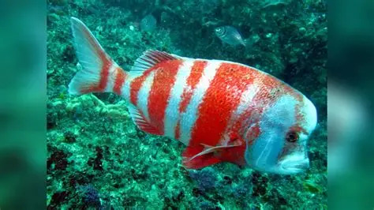

```{r setup, include=FALSE}
knitr::opts_chunk$set(echo = TRUE)
```

[](https://mybinder.org/v2/gh/Joshy-boi/BIO4000W-Chrysoblephus-gibbiceps-diet/HEAD)


This repository was made for the UCT Biological Honours programme.
It centres around a dataset of stomach content analysis data on the diet of the endagered Seabream [*Chrysoblephus gibbiceps*](https://speciesstatus.sanbi.org/assessment/last-assessment/2954/)


```{r Red Stumpnose, echo= FALSE, out.width="60%", include=TRUE, fig.align='center', fig.cap='A male Red stumpnose (Chrysoblephus gibbiceps). Distinctive bulbous forehead and red bands clearly visible.'}

```

These data were collected by third year marine biology students over a period of 2 years (2010-2012). Fish samples were provided by Dr Colin Attwood which he in turn acquired from previous research sampling or were donated to the university by commercial fishing companies (this species is sometimes caught as bycatch and the market is heavily restricted). Various morphological characteristics of each individual fish were recorded, and stomach contents were analysed. These data can be found in the Data folder in my repository along with a metadata pdf explaining the meaning of each variable name in the spreadsheet. 

The interesting folders in my repositories are: 


Code: This folder contains my raw code script (Chrysoblephus_diet_raw_script), a markdown file of my code (Chrysoblephus_diet_clean_code) and a folder of the figures produced in my analysis (Chrysoblephus_diet_clean_code_plots/figure-gfm). 


Data: This folder contains the raw data set (ChrysoblephusDiet), the cleaned data set (cleaned_ChrysoblephusDiet) and a pdf document explaining the variable names in the data sheet (ChrysoblephusDiet metadata).


images: This folder contains the image of Chrysoblephus gibbiceps used in this README. This also contains the plots produced in my code (Chrysoblephus_diet_clean_code_plots/figure-gfm). 

Please enjoy your stay in my repo.


